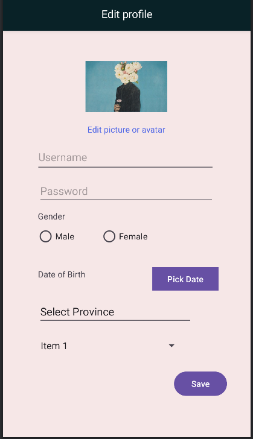

# Android Task

This is a single page android app.

## Overview

A simple Android application that utilizes several user interface elements and functionalities  including EditText, TextView, RadioButton, ImageView, Spinner, Button, AutocompleteTextView, DatePicker, TimePicker, Toast, AlertDialog, and Snackbar. The application  aims to provide a user-friendly experience while showcasing  understanding of these components.

## Screenshots 

## Contributions

Feel free to fork the repository, make changes, and create a pull request.

## License

This project is licensed under the [MIT License](https://opensource.org/licenses/MIT) - see the [LICENSE](LICENSE) file for details.

